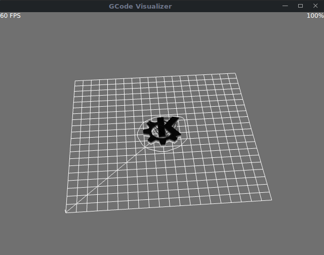

# GCode3D (a Qt-based GCode visualizer)

### Description

GCode3D is a Qt-based visualizer of *.gcode files.

### Media

<div id="pattern" class="pattern">
  <ul class="g">
    <a href="/doc/imgs/1.png"></a>
    <a href="/doc/imgs/2.png"></a>
    <a href="/doc/imgs/3.png"></a>
    <a href="/doc/imgs/4.png"></a>
</ul>
</div>

### Dependencies
GCode3D depends on the following projects:

* [Qt5] - Cross-platform application framework.
* [cmake] - Manage build process.

### Run it

```
$ git clone https://github.com/patrickelectric/Gcode3D.git
$ cd Gcode3D && mkdir build && cd build
$ cmake ..
$ make
$ ./gcodeto3d
```

## Contributing


1. Fork it.
2. Create a branch (`git checkout -b my_markup`)
3. Commit your changes (`git commit -ams "Added something very cool"`)
4. Push to the branch (`git push origin my_markup`)
5. Open a [Pull Request]
6. Enjoy a good book and wait :book:

[Pull Request]: https://github.com/patrickelectric/Gcode3D/pulls
